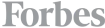
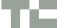

# cside Design System

> **cside** (lowercase, never "c/side") is a client-side security platform. It protects users from browser-based attacks — script skimmers, e-skimming, PII leaks, applicant fraud — and automates PCI DSS 4.0.1 compliance (reqs 6.4.3 & 11.6.1). It sits in the user's browser, watching what every third-party script actually does.

**Tagline: "Security for what runs in the browser."**
**Voice:** Professional, technical, calmly confident. Security-aware without alarmism. Plain English over jargon. Active voice. Short paragraphs.

---

## Files in this skill

This skill ships with the following bundle. Reference these by relative path from any artifact you build.

| Path | What it is | When to use |
|---|---|---|
| `cside-design-skill.md` | This file — the authoring guide. | Read first. Source of truth for rules, recipes, voice. |
| `tokens.css` | Fonts (`@font-face`), color ramps, type scale, radii, shadows, helper classes. | **Load once at the top of every artifact** — `<link rel="stylesheet" href="tokens.css">`. Everything else assumes it is loaded. |
| `ui-kit.html` | Full visual reference — every component, every type size, every color swatch, hero, footer, logo variants, in one scrollable page. | Open this whenever you forget what something should look like. Copy the markup directly — it is the canonical recipe. |
| `previews/type.html` | Type ramp specimen card. | Design System tab preview only. Don't reference from artifacts. |
| `previews/colors.html` | Brand + neutral + semantic palette card. | Design System tab preview only. |
| `previews/spacing.html` | Radii, 4px scale, shadows card. | Design System tab preview only. |
| `previews/components.html` | Buttons / tags / inputs / status / feature cards. | Design System tab preview only. |
| `previews/brand.html` | Logo lockup variants + voice do/don't card. | Design System tab preview only. |
| `fonts/PPNeueMontreal-Book.woff2` | 400 weight (body). | Auto-loaded via `tokens.css`. Don't reference directly. |
| `fonts/PPNeueMontreal-Italic.woff2` | 400 italic. | Auto-loaded. |
| `fonts/PPNeueMontreal-Medium.woff2` | 500 weight (UI labels, buttons, headings — default). | Auto-loaded. |
| `fonts/PPNeueMontreal-Bold.woff2` | 600 weight (rare emphasis). | Auto-loaded. |
| `assets/cside-logo.svg` | Primary horizontal lockup (mark + wordmark, blue). | Default logo. Use anywhere a logo appears. |
| `assets/cside-shield.svg` | Mark only. | Favicon, small placements. |
| `assets/cside-text.svg` | Wordmark only. | Tight horizontals where a mark won't fit. |
| `assets/cside-mark-blue.svg` | Large standalone "c" brand graphic. | Hero illustrations, brand wallpaper, decorative use. |
| `assets/press-forbes.webp` | Forbes logo (grayscale-friendly). | "Featured on" press strip. |
| `assets/press-techcrunch.webp` | TechCrunch logo. | Press strip. |
| `assets/press-wired.webp` | Wired logo. | Press strip. |
| `assets/press-hackernews.webp` | Hacker News logo. | Press strip. |

**Standard artifact preamble** — every HTML file in this design system starts with:

```html
<!DOCTYPE html>
<html lang="en">
<head>
  <meta charset="UTF-8">
  <link rel="stylesheet" href="tokens.css">
  <title>…</title>
</head>
```

That single `tokens.css` import registers the PP Neue Montreal `@font-face`, every CSS custom property (color ramps, type scale, radii, shadows, layout vars), the base resets, and helper classes like `.section-label`, `.section-header`, `.section-description`, `.bordered-section-outer`, `.bordered-section-inner`, `.animate-link`, and `.bg-noise`. Don't reinvent — use the variables.

---

## 1. Brand essence

cside's visual language is **understated, precise, modern enterprise**. It is _not_ a flashy security brand (no neon, no skulls, no "hacker green"). The site's aesthetic is closer to a quiet developer-tool product than a cybersecurity vendor. The signature blue (#0047bb) carries everything. Type does the heavy lifting — there is little decoration.

Three principles, in priority order:

1. **Restraint.** White space, hairline borders, neutral backgrounds. The page should look like a well-engineered document, not a brochure.
2. **Precision.** Type alignment, exact corner radii (10px on buttons, 12px on inputs, 8px on tags). Pixel-honest. No fluff.
3. **One bold blue.** The brand color is reserved. Used on the logo, primary CTAs, eyebrow labels, accent fills, and the footer slab. Never as a body-text color (poor contrast). Never gradient-spammed.

### What to avoid (anti-patterns)
- Drop shadows on cards. The system uses borders, not shadows. The only shadow tokens are `--shadow-icon-box` (subtle inner glow on icon boxes) and `--shadow-input`.
- Gradient backgrounds on hero or large surfaces. The brand uses solid blue or solid white, with optional subtle film/noise overlays.
- Rounded-corners-with-left-border-accent containers. Anti-pattern.
- Emoji in product UI.
- Inventing new colors. If a token doesn't fit, mix existing ones with `color-mix()` or use neutral.

---

## 2. Color

The palette lives in `tokens.css`. Five families, each with a 25→950 ramp:

| Family | Variable | Where it goes |
|---|---|---|
| **Brand** | `--color-brand-500` (#0047bb) | Primary CTAs, eyebrow labels, links, footer, logo |
| **Neutral** | `--color-neutral-{0..950}` | Text (700–900), borders (200), surfaces (0, 50, 100), placeholder text (500) |
| **Success** | `--color-success-500` (#17b26a) | Status pills ("Operational"), green checks |
| **Error** | `--color-error-500` (#f04438) | Destructive states, attack alerts |
| **Warning** | `--color-warning-500` (#f79009) | Compliance gaps, advisory banners |

### Default mappings (memorize these)
- **Body text:** `--color-neutral-700` on white, `--color-neutral-900` for emphasis.
- **Muted text / descriptions:** `--color-neutral-500`.
- **Borders / dividers:** `--color-neutral-200`. Hairline only — `1px solid`.
- **Card / section backgrounds:** `--color-neutral-0` (white) or `--color-neutral-50` for subtle differentiation.
- **Eyebrow labels:** `--color-brand-500`, uppercase, tracked, 14px.
- **Primary CTA fill:** see button recipe below — it's a gradient from `#1D5DC3` to `--color-brand` with a 1px inner brand "before" element. Don't simplify to a flat fill.
- **Footer:** full-bleed `--color-brand-500` slab with white text.

### Tag / badge color pairings
A status pill uses three tones from one family:
```
bg:  --color-{family}-50
border: --color-{family}-200
text: --color-{family}-700
```
This pattern is non-negotiable — apply it for brand, neutral, success, error, warning.

---

## 3. Typography

**One typeface: PP Neue Montreal.** Loaded automatically by `tokens.css` from `fonts/`. Available weights:

- 400 (Book) — body
- 400 italic — emphasis in prose only
- 500 (Medium) — UI labels, buttons, headings (default heading weight)
- 600 (Bold) — rare; only when a heading must outweigh adjacent 500 text

PP Neue Montreal is the ONLY family. Code/`<pre>` falls back to ui-monospace. There is no secondary serif, no display face.

### Type ramp (use the variables)

| Role | Token | px / line-height | Weight | Tracking |
|---|---|---|---|---|
| Eyebrow label | `--text-sm` + `.section-label` | 14 / 14 | 500 | +1px, UPPER |
| Body small | `--text-sm` | 14 / 20 | 400 | — |
| Body | `--text-md` | **15** / 24 | 400 | — |
| Body large (lede) | `--text-lg` | 18 / 28 | 400 | — |
| UI label | `--text-md` | 15 / 24 | 500 | — |
| Section header (most pages) | `.section-header` | **40** / 44 | 500 | -2% |
| Display sm | `--text-display-sm` | 30 / 38 | 500 | — |
| Display md | `--text-display-md` | 36 / 44 | 500 | -2% |
| Display lg (hero h1) | `--text-display-lg` | 48 / 60 | 500 | -2% |
| Display xl | `--text-display-xl` | 60 / 72 | 500 | -2% |
| Display 2xl (rare hero) | `--text-display-2xl` | 72 / 84 | 500 | -2% |

> **Body default is 15px**, not 16. The site uses `--text-md = 0.9375rem` because 16px is just too big on screens. Match this.

### Headings
- Default heading weight is **500 (Medium)**, never 700. PP Neue Montreal Medium has the right authority on its own.
- Tighten tracking (`letter-spacing: -0.02em`) on every display-size heading.
- Use `text-wrap: balance;` on h1/h2 so multi-line headings break cleanly.
- Section titles use the helper class `.section-header` — 40px, line-height 1.1, weight 500, balanced. Don't drift.

### The "label + title + description" stack
The most common copy block on every section:

```html
<div class="block-stack">
  <p class="section-label">Client-side Platform</p>
  <h2 class="section-header">Protect Web Users from Attacks,<br>Protect Your Company from Fraud</h2>
  <p class="section-description">Your WAF protects the server. cside protects your customers…</p>
</div>
```

This rhythm — small uppercase blue eyebrow → large medium-weight heading → muted description — is the spine of every long-form page. Re-use it.

---

## 4. Iconography

The site uses **Lucide icons** (`lucide-react` / `@lucide/astro`) as the universal icon set. Stroke 1.5–2, 16–20px most places. There are only two custom inline SVG icons in the codebase (`check`, `star`) — everything else is Lucide. Stick to Lucide.

Icon usage rules:
- Inline icons in body copy: 16px, color `currentColor`.
- "Feature icons" in icon boxes: 20–24px, brand-blue stroke, on a 40px white rounded-square with `--shadow-icon-box`.
- Never decorate with icons just to fill space. One per feature card max.
- Don't draw your own icons in SVG when you could use a Lucide name. Drop a placeholder if Lucide doesn't have it and ask the user.

If you need icons in plain HTML output, use Lucide's inline SVGs by name — search at https://lucide.dev for the exact name. Common names you'll need: `shield`, `check`, `chevron-right`, `chevron-down`, `mail`, `arrow-up-right`, `lock`, `code`, `globe`, `eye`, `alert-triangle`.

---

## 5. Layout

### The bordered-section primitive
Every major section on every page is wrapped in a `<BorderedSection>`: a full-width container with a bottom border, holding a centered inner box (max 1392px, 80% width on desktop) with vertical side-borders. Pages read as a stack of these — the borders are the page's visual rhythm.

```html
<section class="bordered-section-outer">
  <div class="bordered-section-inner">
    <!-- section content here -->
  </div>
</section>
```

(Both classes are pre-defined in `tokens.css`.) Padding inside: `p-6` mobile / `p-16` desktop (1.5rem / 4rem). Don't override casually.

### Spacing scale
The site uses Tailwind's default 4px scale (`gap-1` = 4px, `gap-2` = 8px, etc.). Common rhythms: 24px between paragraph elements, 48–64px between blocks within a section, the bordered-section's own 64px padding between sections. Avoid arbitrary values like `gap-[18px]`.

### Max widths
- **Page content max:** 1392px (`--container-most`).
- **Inner bordered box:** 80% of viewport, capped by container-most.
- **Body text columns:** ~640–720px for readability.

---

## 6. Components

All recipes below assume `tokens.css` is loaded. They use plain HTML/CSS — no Tailwind required for the artifact, but class names mirror what you'd see in the codebase so reading them is familiar. Live versions of every recipe are in `ui-kit.html`.

### 6.1 Button — primary (brand)
The signature button. **3D feel: a 1px-inset "before" layer over a top-down gradient creates a soft bevel that depresses on click.** Don't simplify.

```html
<button class="btn btn-brand"><span>Start for free</span></button>
```
```css
.btn {
  position: relative;
  display: inline-block;
  height: fit-content;
  padding: 8px 12px;
  border-radius: 10px;             /* exact */
  font: 500 14px/1 var(--font-sans);
  text-align: center;
  white-space: nowrap;
  transition: all 100ms ease-out;
  transform: translateZ(0);
  cursor: pointer;
  border: none;
}
.btn:active:not(:disabled) { transform: translateZ(-4px); }

.btn-brand {
  color: white;
  background: linear-gradient(to bottom, #1D5DC3, var(--color-brand));
}
.btn-brand::before {
  content: "";
  position: absolute;
  inset: 1px;
  border-radius: 9px;
  background: var(--color-brand);
  z-index: 0;
}
.btn-brand > * { position: relative; z-index: 1; }
.btn-brand:hover { filter: brightness(0.9); }
```

### 6.2 Button — neutral (secondary)
```css
.btn-neutral {
  background: white;
  color: var(--color-neutral-800);
  border: 1px solid var(--color-neutral-300);
}
.btn-neutral:hover { filter: brightness(0.95); }
```

### 6.3 Button — tertiary (ghost)
```css
.btn-tertiary {
  background: transparent;
  color: var(--color-neutral-600);
}
.btn-tertiary:hover { background: var(--color-neutral-200); }
```

### 6.4 Tag / Badge
Small status or category pill. Always rounded-lg, hairline border, the 50/200/700 family triplet.
```html
<span class="tag tag-brand">PCI DSS 4.0.1</span>
<span class="tag tag-neutral">Beta</span>
```
```css
.tag {
  display: inline-flex;
  align-items: center;
  padding: 2px 6px;
  border-radius: 8px;
  border: 1px solid;
  font: 500 12px/1.4 var(--font-sans);
  white-space: nowrap;
}
.tag-brand   { background: var(--color-brand-50);   border-color: var(--color-brand-200);   color: var(--color-brand-700); }
.tag-neutral { background: var(--color-neutral-50); border-color: var(--color-neutral-200); color: var(--color-neutral-700); }
.tag-success { background: var(--color-success-50); border-color: var(--color-success-200); color: var(--color-success-700); }
.tag-error   { background: var(--color-error-50);   border-color: var(--color-error-200);   color: var(--color-error-700); }
.tag-warning { background: var(--color-warning-50); border-color: var(--color-warning-200); color: var(--color-warning-700); }
```

### 6.5 Input
```html
<label class="input">
  <input type="text" placeholder="yoursite.com">
</label>
```
```css
.input {
  display: flex;
  align-items: center;
  gap: 8px;
  width: 100%;
  padding: 8px 12px;
  border-radius: 12px;
  border: 1px solid var(--color-neutral-200);
  background: white;
  box-shadow: var(--shadow-input);
  outline: 2px solid transparent;
  transition: outline-color 200ms;
}
.input:focus-within { outline-color: color-mix(in srgb, var(--color-brand-500) 20%, transparent); }
.input input {
  flex: 1;
  border: none; outline: none;
  font: 500 15px/1.5 var(--font-sans);
  color: var(--color-neutral-700);
}
.input input::placeholder { color: var(--color-neutral-500); font-weight: 400; }
```

### 6.6 Feature / icon box
A 40×40 white rounded square with the subtle inset shadow, holding a brand-blue Lucide icon.
```html
<div class="icon-box">
  <svg><!-- lucide shield --></svg>
</div>
```
```css
.icon-box {
  width: 40px; height: 40px;
  display: grid; place-items: center;
  background: white;
  border-radius: 10px;
  box-shadow: var(--shadow-icon-box);
  color: var(--color-brand-500);
}
```

### 6.7 Card
Cards use border, **not shadow**. Internal padding 24–32px.
```css
.card {
  background: white;
  border: 1px solid var(--color-neutral-200);
  border-radius: 16px;
  padding: 24px;
}
```

### 6.8 Status indicator (footer "all systems operational")
Small dot + label. Uses success/warning/error families.
```html
<span class="status">
  <span class="status-dot"></span>
  All systems operational
</span>
```
```css
.status { display: inline-flex; align-items: center; gap: 8px; font-size: 14px; }
.status-dot {
  width: 8px; height: 8px; border-radius: 999px;
  background: var(--color-success-500);
  box-shadow: 0 0 0 3px color-mix(in srgb, var(--color-success-500) 25%, transparent);
}
```

### 6.9 Press strip
"Featured on" — a row of grayscale press logos (Forbes, TechCrunch, Wired, Hacker News). Use the four `.webp` files in `assets/`. Filter to gray + low opacity at rest.
```html




```
```css
.press-logo { height: 28px; opacity: 0.6; filter: grayscale(1); transition: opacity 150ms; }
.press-logo:hover { opacity: 1; }
```

---

## 7. Hero pattern

The homepage hero is the canonical layout for any landing page:

1. Small **brand tag** ("PCI DSS 4.0.1").
2. **H1, 48–60px** (`.section-header` for sub-pages, `--text-display-lg` for the main hero), weight 500, balanced. Two-tone allowed: neutral-900 + brand-500 for the keyword.
3. **One-line description**, neutral-500, max ~640px.
4. **Two CTAs:** primary brand button + neutral button. Order matters — brand left, neutral right.
5. Optional **subtext** under CTAs in `--text-xs`, neutral-500.
6. **"Featured on" press strip** below.

---

## 8. Imagery & illustration

The site mixes a few well-defined visual treatments:

- **Press / partner logos:** flat WebP, grayscale at rest. Files in `assets/press-*.webp`.
- **Product screenshots:** screenshot of `dash.cside.com` floated over the section, often clipped at the bottom edge of a section.
- **Brand "anchor" / "palm" / "scuba" motifs:** stylized monochrome illustrations used as background imagery in the footer and dark sections (a quiet, slightly nautical/exploratory metaphor — "the depths of the browser"). Use `assets/cside-mark-blue.svg` as a quick stand-in if you need a brand graphic.
- **Dither / noise textures:** the `.bg-noise` helper class (in `tokens.css`) adds a subtle SVG noise overlay; pair with brand-fill backgrounds to add tactile depth.

When you need an image you don't have, **use a clearly-labeled placeholder** — a neutral-100 box with a thin border, neutral-400 italic label saying what it represents. Don't generate an SVG illustration.

---

## 9. Logo

`assets/cside-logo.svg` is the primary horizontal lockup (mark + wordmark, blue). Other variants:
- `assets/cside-shield.svg` — mark only, used as favicon and small placements
- `assets/cside-text.svg` — wordmark only, for tight horizontals
- `assets/cside-mark-blue.svg` — large standalone "c" mark, for hero / brand graphics

**Clear space:** keep at least the height of the lowercase "c" around the logo. **Min size:** 24px tall for the lockup. Never recolor — only the supplied blue or all-white (on brand-500 or darker backgrounds) are valid.

---

## 10. Writing & content rules

- Lowercase **cside** — never "C/Side", "Cside", "CSide". The "c" is always lowercase, even at the start of a sentence.
- "client-side" hyphenated. "e-commerce" hyphenated. "third-party" hyphenated.
- American English.
- Concrete > vague. Prefer "Stop scripts that steal credit cards" over "Comprehensive client-side protection."
- Numbers fight FUD. Use "PCI DSS 6.4.3 & 11.6.1", "100% historical tracking", "14-day trial" — the site quantifies often.
- Don't fearmonger. The tone is "we noticed your blind spot, here's how to fix it" not "ATTACKERS ARE COMING."
- CTAs the site uses: "Start for free", "Talk to an expert", "Book a demo", "Check my site".

---

## 11. Quick start checklist

For any new artifact:

1. Create the HTML file with the standard preamble — `<link rel="stylesheet" href="tokens.css">` in `<head>`.
2. Open `ui-kit.html` in another tab. Copy the recipe you need.
3. Reach for variables (`var(--color-brand-500)`, `var(--text-display-lg)`) over hex codes / px values.
4. Use `.section-label` + `.section-header` + `.section-description` for every copy block.
5. Wrap major sections in `.bordered-section-outer > .bordered-section-inner`.
6. Use Lucide icon names. Use the four press logos in `assets/` for any "featured on" strip. Use `assets/cside-logo.svg` for the lockup.
7. Borders, not shadows. Hairline 1px in `--color-neutral-200`. The two shadow tokens are reserved for icon boxes and inputs.
8. Lowercase **cside** everywhere.

When in doubt, open `ui-kit.html` and copy the markup. It's the source of truth for the recipes.
